# Leaflet学习(Mars3D)

## 一 快速开始

**[中文教程](http://mars2d.cn/go.html?id=12)--小白必备**

**[中文API文档](http://mars2d.cn/go.html?id=13)--学会查阅文档**

准备工作-引入文件

```
 <link rel="stylesheet" href="https://cdn.bootcss.com/leaflet/1.2.0/leaflet.css" />
 <script src="https://cdn.bootcss.com/leaflet/1.2.0/leaflet.js"></script>
```

初始化页面--准备好一个容器

```
 <div id="mapid"></div>
  * {
      margin: 0;
      padding: 0;
    }

    #mapid {
      height: 100vh;
    }
```

创建一个地图--两种方式

```
var map = L.map('mapid').setView([27.550894, 121.529732], 4);   //坐标和缩放尺寸
```

第二种方式

```
  var map = L.map('mapid', {
    center: [27.550894, 121.529732],
    zoom: 4
  });
```

地图已经出来了,只是还没有皮肤.快给你的地图设置一个瓦片(底图)图层吧 ! 

```
L.tileLayer("http://webrd01.is.autonavi.com/appmaptile?lang=zh_cn&size=1&scale=1&style=7&x={x}&y={y}&z={z}").addTo(map);
```

效果已经出来喽  接下来才是重头戏 ! 

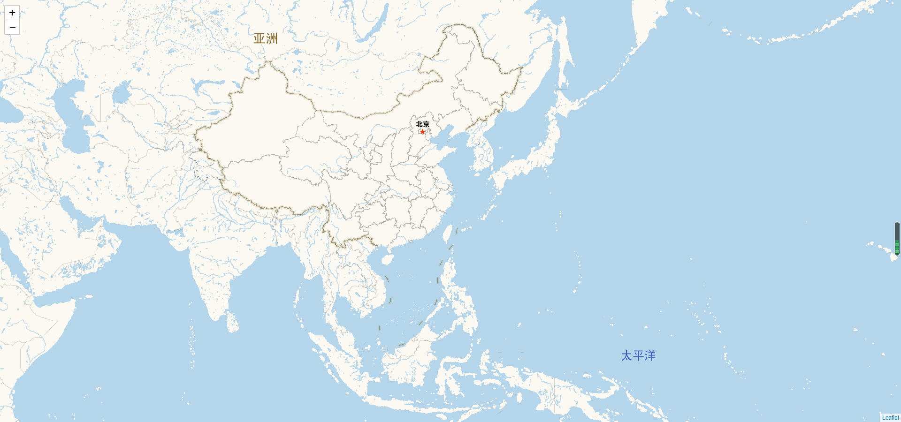

## 二 开始入门

### 标注点和线

首先准备好一个地图

```
 var map = L.map('mapid').setView([31.124451, 113.345322], 9);
    L.tileLayer("http://webrd01.is.autonavi.com/appmaptile?lang=zh_cn&size=1&scale=1&style=7&x={x}&y={y}&z={z}").addTo(map);
```

让我们标记一个点吧 ! 

```
var marker = L.marker([31.5, 113.09]).addTo(map);
```

效果太感动了!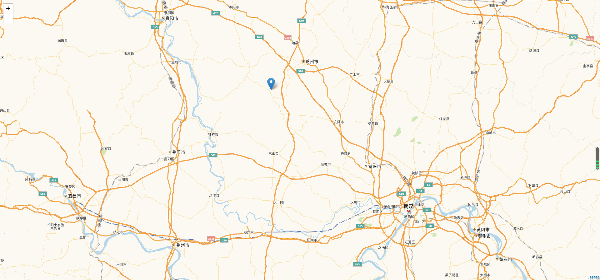

线是由多个坐标连接起来的哟,所以是一个二维数组

```
	var latlngs = [
      [45.51, -122.68],
      [37.77, -122.43],
      [34.04, -118.2]
    ];
    var polyline = L.polyline(latlngs, {
      color: 'red'
    }).addTo(map);
    
    map.fitBounds(polyline.getBounds());// 缩放地图到折线所在区域
```

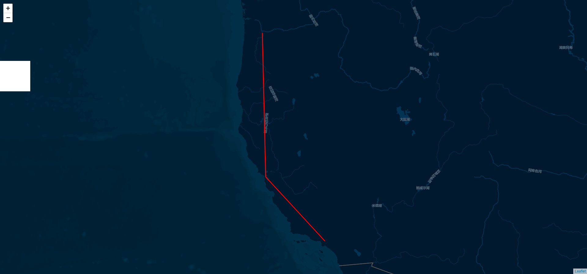

### 圆和多边形

接着我们加一个圆试试

```
 var circle = L.circle([31, 113], 4000, {
    color: 'red',
    fillColor: '#f03',
    fillOpacity: 0.5
}).addTo(map);
```

啊~~~简单 !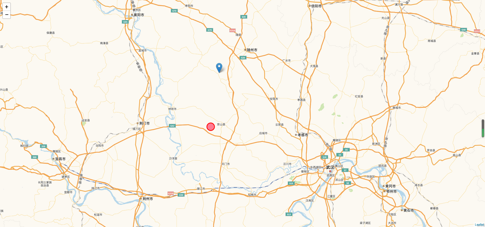

多边形也就是这样而已

```
var polygon = L.polygon([
    [31.509, 113.08],
    [31, 113.06],
    [31.51, 112]
]).addTo(map);
```

so easy !

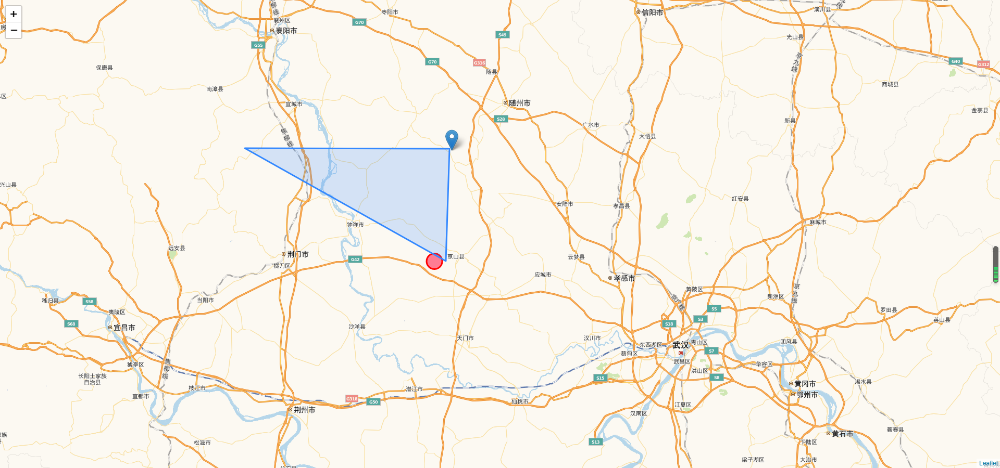


## 三 自定义图标标记

想要自定义标记点图片咋整捏?

```
var greenIcon = L.icon({ //定义了一个图标 greenIcon
      iconUrl: 'http://mars2d.cn/forleaflet/docs/images/leaf-red.png', //图片地址
      shadowUrl: 'http://mars2d.cn/forleaflet/docs/images/leaf-shadow.png', //阴影图片地址
      iconSize: [38, 95], //图片的大小
      shadowSize: [50, 64], //阴影图片大小
      iconAnchor: [22, 94], //图片对齐偏移
      shadowAnchor: [4, 62], //阴影图片对齐偏移
    });		//可以不设置阴影图片和相关属性
```

定义好了 ,咱来用他创建个点看看吧

```
 L.marker([31.5, 113.09], {icon: greenIcon}).addTo(map);  //greenIcon是刚才定义的图标相关属性
```

嘿嘿 , 有点好看唉 !

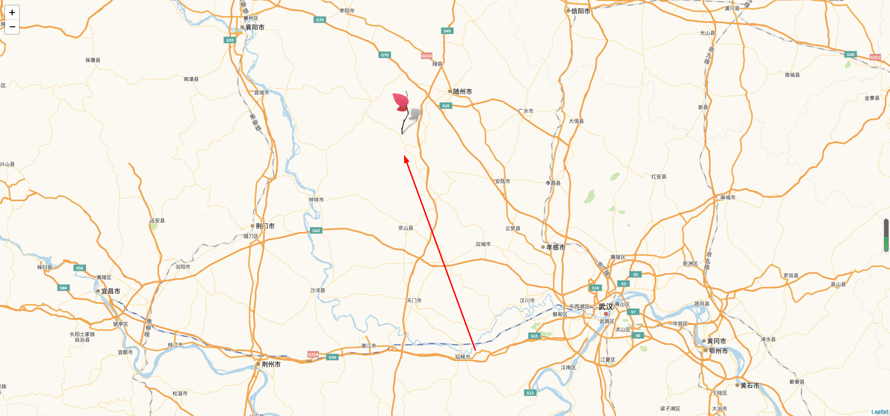

如果要频繁定义图标的话推荐使用图标类,咋整?

```
		var LeafIcon = L.Icon.extend({
        options: { //定义了一个图标类
        shadowUrl: 'http://mars2d.cn/forleaflet/docs/images/leaf-shadow.png',
        iconSize: [38, 95],   //注意,这里没设置图片
        shadowSize: [50, 64],
        iconAnchor: [22, 94],
        shadowAnchor: [4, 62],
        popupAnchor: [-3, -76]
      }
```

定义了类当然还不够 ! 通过new构造实例对象,给上图片 !  好了,一个图标就定义完成了!

```
	var greenIcon = new LeafIcon({
      iconUrl: 'http://mars2d.cn/forleaflet/docs/images/leaf-green.png'
    });
    var redIcon = new LeafIcon({
      iconUrl: 'http://mars2d.cn/forleaflet/docs/images/leaf-red.png'
    });
    var orangeIcon = new LeafIcon({
      iconUrl: 'http://mars2d.cn/forleaflet/docs/images/leaf-orange.png'
    });
```

老规矩了,绘点,给图标,显示在地图上

```
	L.marker([31.5, 113.09], {		//这里格式有点问题,不碍事,往上翻创建点你们都懂的
      icon: greenIcon	
    }).addTo(map);
    L.marker([31, 113.09], {
      icon: redIcon
    }).addTo(map);
    L.marker([31.5, 112.09], {
      icon: orangeIcon
    }).addTo(map);
```

相信你们已经掌握定义图标标记了吧 !

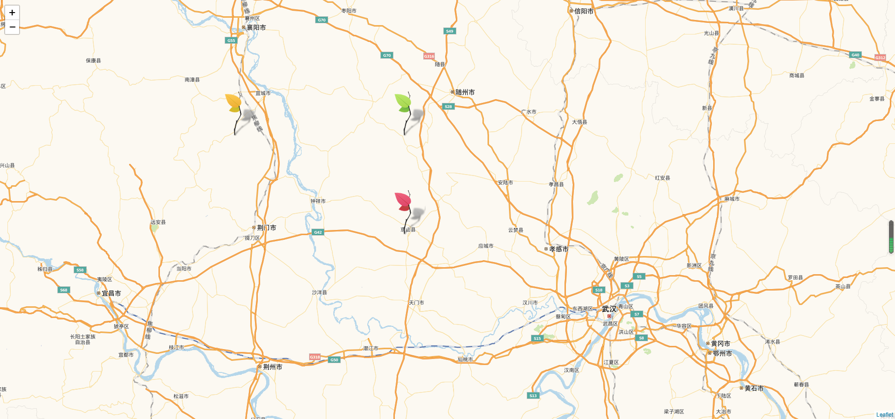

## 四 图层组与图层控制

### 		图层组

有时候我们会在地图上创建多个东西,有冲突了,或者想要集体控制,咋办呢?

演示一下吧 ! ! 首先我们先创建几个标记点

```
 	var littleton = L.marker([31.61, 115.02])//只是创建没有添加到地图上哟
    var denver = L.marker([31.74, 114.99])//没有添加addTo
    var aurora = L.marker([31.73, 114.8])
    var golden = L.marker([31.77, 115.23])
```

太多了不好管理啊 , 添加到图层组中集中管理吧 ! 

```
var cities = L.layerGroup([littleton, denver, aurora, golden]);//组名字是cities
cities.addTo(map)//把图层组添加到地图上
```

来体验一下统一管理吧 !

```
cities.addTo(map);//把图层组添加到地图上
或者
cities.remove(map)//把图层组从地图上删除
```

嗯~自己整了个按钮,这一闪一现的还蛮好玩 , 哈哈

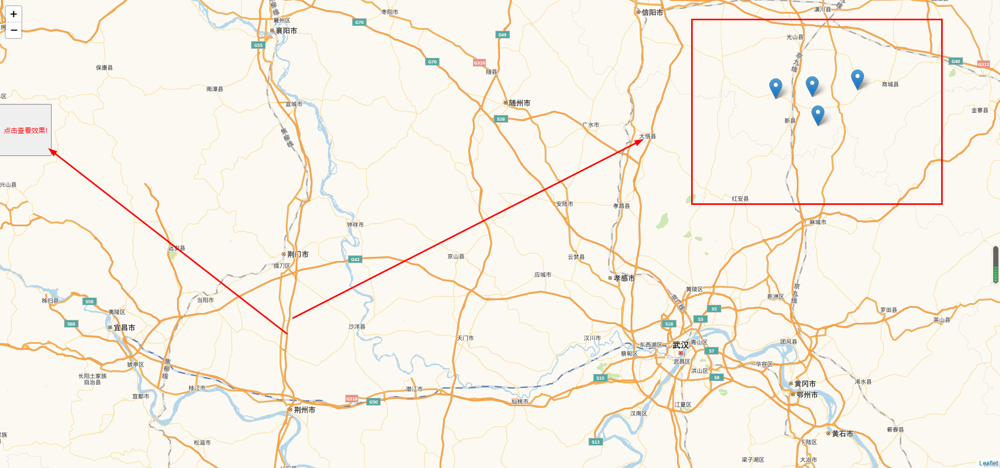

### 图层组控制

老规矩 , 首先创建一个地图喽

```
 var map = L.map('map').setView([39.86, 116.45], 9);
```

说是图层组控制,当然要有多个图层组了 , 下面定义两个图层组(底图)

```
 var baseLayers = { //定义两个图层在baseLayers里
      //还记得快速入门的他吗?给地图穿上皮肤(底图)addTo默认给他添加到地图上
      "OSM": L.tileLayer('http://{s}.tile.openstreetmap.org/{z}/{x}/{y}.png').addTo(map),
      'Sputnik': L.tileLayer('http://{s}.tiles.maps.sputnik.ru/{z}/{x}/{y}.png'),
    };
```

创建一个控制器,咱们来控制一下

```
 L.control.layers(baseLayers, {}, {}).addTo(map);//控件默认在左上角
```

舒服~~

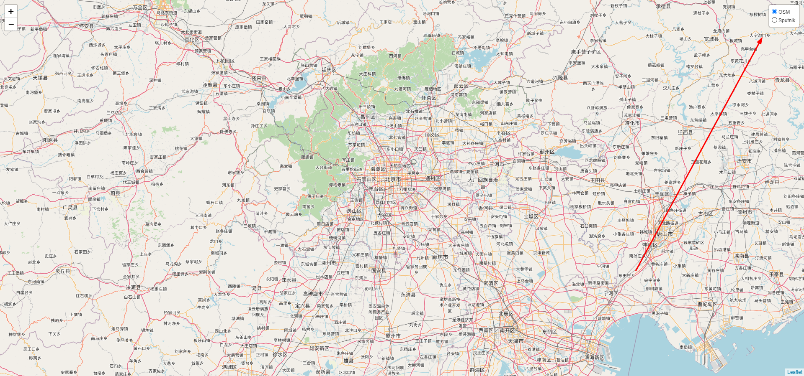

## 五 弹出框 提示框

### 	弹出框

老规矩了,创建一个地图,绘制一个标注点  咱们开始吧 !

```
var map = L.map('mapid').setView([31.124451, 113.345322], 9);
    L.tileLayer("http://webrd01.is.autonavi.com/appmaptile?lang=zh_cn&size=1&scale=1&style=7&x={x}&y={y}&z={z}").addTo(map);
    var marker = L.marker([31.5, 113.09]).addTo(map);
```

肘子!

```
//给刚刚绘制的点坐标绑定(bindPopup)一个弹窗吧!
marker.bindPopup("你好啊!我是小陈").openPopup();//.openPopup();默认打开弹窗
```

简单 ! 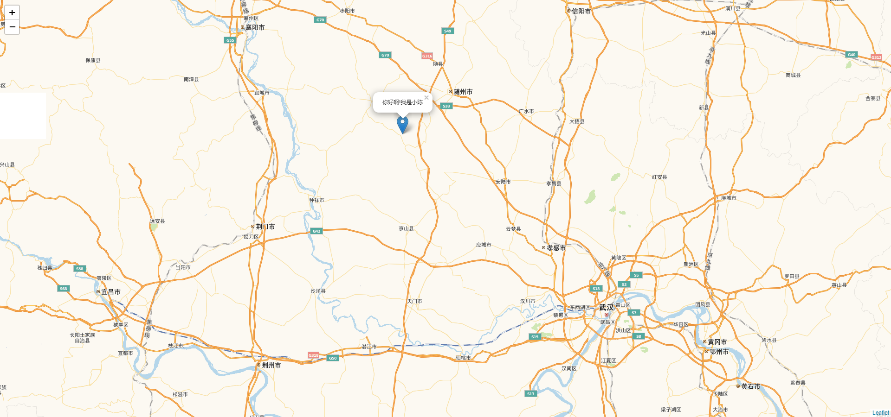

不仅仅可以绑定到坐标上哟,还可以在指定坐标上

```
 //硬核翻译又来了 ! 定义弹窗  修改坐标  修改内容  添加到地图
  L.popup().setLatLng([31.5, 113.09]).setContent("我是小陈").addTo(map);
```

如果和之前定义的图标弹窗冲突可以使用openOn代替addTo方法，新的方法将更加的好用 !

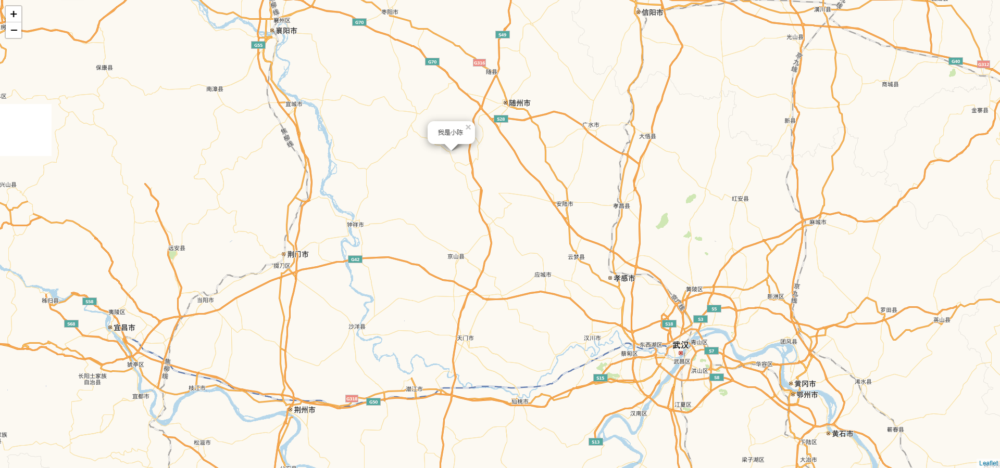

### 提示框

提示框是啥啊? 比如,鼠标悬浮目标时提示的信息 . 优点是可以自定义样式 , 嘿嘿嘿

```
 //老朋友了,没啥好介绍的
 var map = L.map('mapid').setView([31.124451, 113.345322], 9);
    L.tileLayer("http://webrd01.is.autonavi.com/appmaptile?lang=zh_cn&size=1&scale=1&style=7&x={x}&y={y}&z={z}").addTo(map);
    var marker = L.marker([31.5, 113.09]).addTo(map);
```

整个鼠标移入事件 , 下一节有说 , 先使用一下

```
	marker.on('mouseover',function onmsover(){ 
      
    }); 
```

在移入事件里放入一个提示框吧

```
//硬核翻译又来了.... 自定义一个需要展示的提示框popText
var popText = '<div style="width: 100px;height: 200px;background-color: pink;color:"#fff">你好啊!</div>'
//e.target就是当前触发移入事件的对象 绑定提示框popText 后面的{}可以设置一些参数详情看api文档.  openTooltip打开提示框
e.target.bindTooltip(popText, {}).openTooltip();
```

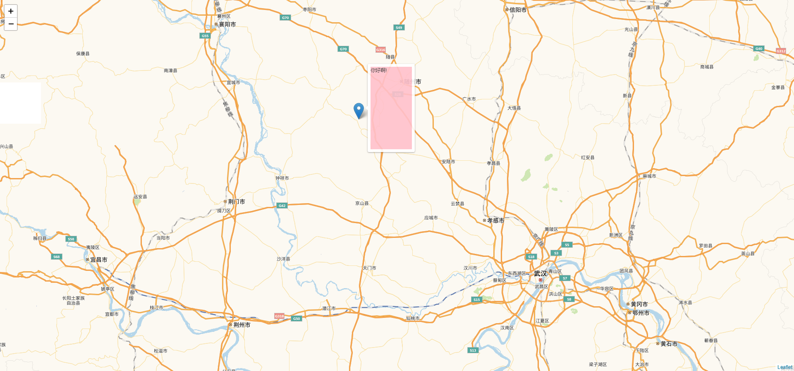

## 六 事件处理

处理事件很简单滴 , 直接走起

```
map.on('click', onMapClick); //给整个map地图绑定一个点击事件onMapClick
    function onMapClick(e) {  //事件默认接受到一个参数,以后有很多用处哦!打开控制台打印看看吧!
      alert('你好啊!')
      console.log(e);
    }
```

当然 , 除了点击事件之外还有很多事件的 ! 可以查api文档看看哦

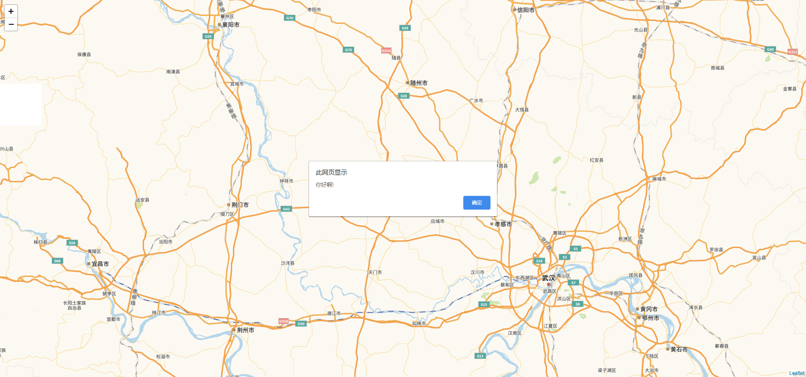

事件传递参数

```
	var a = 1;
    map.on('click', onMapClick); 
    function onMapClick(e) { 
     console.log(a);	//a是1
    }
```

哈哈哈 , 是不是感觉好像开玩笑一样?哪里传递了?其实能拿到最好了,关于传递参数我找了好久!

这里说一个事件传递参数的笨方法,本人也才刚学,希望有大佬指点

```
	 var a = 1;
    map.on('click', onMapClick);
    function onMapClick(e) {
      onmsover(e, a)
    }
    function onmsover(e, a) {
      console.log(a);	//a是1
    }
```

哈哈哈 , 是不是感觉这套的啥啊 ! 还有点意思? 其实能满足一些业务需求的 ! 这里也求大佬指点

# 小白实战

话说在前!  ! 本人以记录为目的 , 本身自己也是小白 ! 写的不好的地方希望有大佬可以指出

## 项目展示

实现效果预览 http://typhoon.nmc.cn/web.html

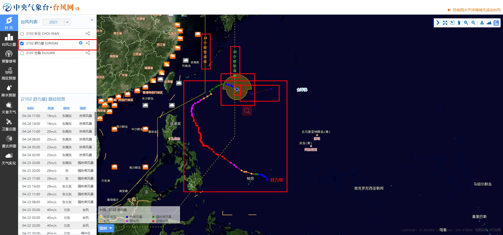

- 展示`Leaflet`二维地图
- 展示台风列表，支持`显示`/`隐藏`指定台风
- 绘制`24小时`警戒线
- 绘制`48小时`警戒线
- 绘制台风实际路径，使用不同颜色进行等级`typlevel`区分
- 使用`img/icon.gif`标记台风当前状态
- 绘制台风预测路径，和`实际路径`进行闭合
- 使用`lib/Semicircle.js`绘制台风半径圈
- 鼠标移入展示`台风信息tip`，鼠标移出消失

## 接口文档说明

- 警戒线

> `24h.json` 24小时警戒线

> `48h.json` 48小时警戒线

- 台风列表

> `trackPage.json` 台风列表

| **字段名**  | **字段描述** | **类型** | **长度** | **说明** |
| ----------- | ------------ | -------- | -------- | -------- |
| typnumber   | 台风编号     | BIGINT   |          |          |
| chinesename | 中文名       | VARCHAR  | 20       |          |
| englishname | 英文名       | VARCHAR  | 20       |          |

台风路径信息

> `actualTrack.json` 实际路径

> `forecastTrack.json` 预测路径

|                     |                       |          |          |                                     |
| ------------------- | --------------------- | -------- | -------- | ----------------------------------- |
| **字段名**          | **字段描述**          | **类型** | **长度** | **说明**                            |
| typnumber           | 台风编号              | BIGINT   |          |                                     |
| ybcenter            | 预报中心              | VARCHAR  | 20       | BJ,TK                               |
| year                | 年                    | VARCHAR  | 20       |                                     |
| month               | 月                    | VARCHAR  | 20       |                                     |
| day                 | 日                    | VARCHAR  | 20       |                                     |
| hour                | 时                    | VARCHAR  | 20       |                                     |
| filesuffix          | 时效                  | VARCHAR  | 20       | 00表示实测，其他表示预报，如12,24等 |
| lon                 | 经度                  | FLAOT    |          |                                     |
| lat                 | 纬度                  | FLOAT    |          |                                     |
| maxwind             | 最大风速              | FLOAT    |          |                                     |
| centerpress         | 中心气压              | FLOAT    |          |                                     |
| zfwind              | 阵风风速              | FLOAT    |          |                                     |
| level7radius1       | 7级风圈半径1          | FLOAT    |          |                                     |
| level7radius1direc  | 7级风圈半径1对应方位  | VARCHAR  | 20       |                                     |
| level7radius2       | 7级风圈半径2          | FLOAT    |          |                                     |
| level7radius2direc  | 7级风圈半径2对应方位  | VARCHAR  | 20       |                                     |
| level7radius3       | 7级风圈半径3          | FLOAT    |          |                                     |
| level7radius3direc  | 7级风圈半径3对应方位  | VARCHAR  | 20       |                                     |
| level7radius4       | 7级风圈半径4          | FLOAT    |          |                                     |
| level7radius4direc  | 7级风圈半径4对应方位  | VARCHAR  | 20       |                                     |
| Level10radius1      | 10级风圈半径1         | FLOAT    |          |                                     |
| Level10radius1direc | 10级风圈半径1对应方位 | VARCHAR  | 20       |                                     |
| Level10radius2      | 10级风圈半径2         | FLOAT    |          |                                     |
| Level10radius2direc | 10级风圈半径2对应方位 | VARCHAR  | 20       |                                     |
| Level10radius3      | 10级风圈半径3         | FLOAT    |          |                                     |
| Level10radius3direc | 10级风圈半径3对应方位 | VARCHAR  | 20       |                                     |
| Level10radius4      | 10级风圈半径4         | FLOAT    |          |                                     |
| Level10radius4direc | 10级风圈半径4对应方位 | VARCHAR  | 20       |                                     |
| ybradius            | 预报半径              | FLOAT    |          |                                     |
| removedirec         | 移向                  | VARCHAR  | 20       |                                     |
| removespeed         | 移速                  | FLOAT    |          |                                     |
| typlevel            | 台风等级              | INT      |          |                                     |


## 一  绘制地图和警戒线 

绘制地图(如果忘了就往上看开始入门)

```
//地图两种方式
    // var map = L.map('mapid').setView([27.550894, 121.529732], 4);
    var map = L.map('mapid', {
      center: [27.550894, 121.529732],
      zoom: 4
    });
//瓦片 L.tileLayer("http://map.geoq.cn/ArcGIS/rest/services/ChinaOnlineStreetPurplishBlue/MapServer/tile/{z}/{y}/{x}")
.addTo(map);
```

绘制警戒线

```
var polyline = L.polyline(latlngs, { color: 'yellow', weight: '1' }).addTo(map); //latlngs是坐标信息,稍后放在博客
var polyline2 = L.polyline(latlngs2, { color: 'yellow', weight: '1', dashArray: '5' }).addTo(map);//dashArray是显示虚线
```

给警戒线一个名字吧(文字定位)

```
	var myIcon = L.divIcon({	//定义一个myIcon配置项
      iconAnchor: [5, 0],	//偏移 如果不偏可以不加
      className: 'my-div-icon',	//类名
      html: "24</br>小</br>时</br>预</br>警</br>线",	//html信息
      iconSize: 30		字号
    });
    var wenzi = L.marker(latlngs[0], {	//定位到警戒线坐标的第一个点
      icon: myIcon		//信息使用配置项myIcon的
    }).addTo(map);
```

是不是非常滴奈斯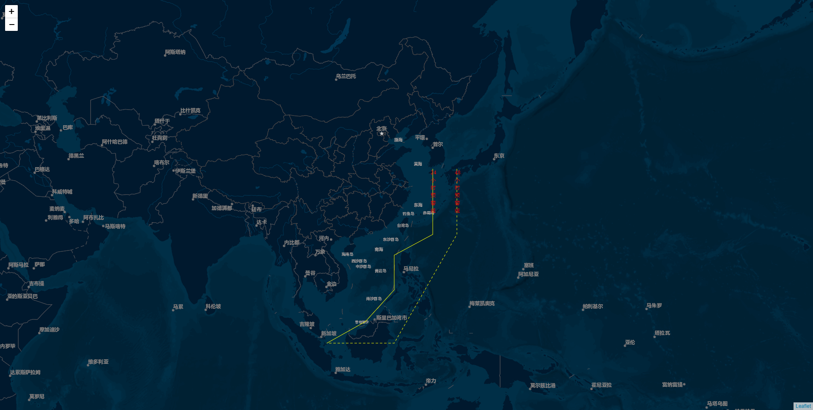


## 二 绘制台风路径线路(分段变色)

actualTrack是台风的json数据 

### 绘制台风路径点(分段变色)

先把点绘制出来试试

```
actualTrack.data.forEach((item) => {
//circleMarker是圆点标记 ,和点标记一样使用的
var dian2 = L.circleMarker([item.lat, item.lon], { color: "red", fillColor: 'red', radius: 3, fillOpacity: 1 }).addTo(map)
//用forEach循环点坐标打点,[item.lat, item.lon]就是json数据里的坐标信息
})
```

点出来了,那咋分段变色?   --通过判断数据中心的`typlevel`(台风等级)区分 . 走着,给他染个色

```
//上面打的点就注释掉吧.咱们判断等级分段变色打点了!
if (item.typlevel == 2) {	//json数据中一共就两个台风等级
	var dian2 = L.circleMarker([item.lat, item.lon], { color: "#0000c0", fillColor: '#0000c0', radius: 3, fillOpacity: 1 });     
} else {
	var dian2 = L.circleMarker([item.lat, item.lon], { color: 'red', fillColor: 'red', radius: 3, fillOpacity: 1 });     
	}
```

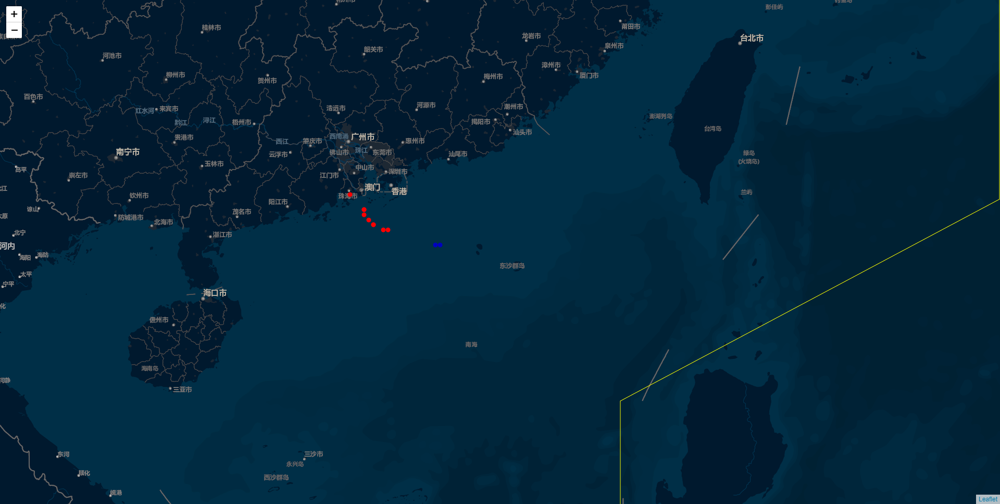

### 绘制台风路径线(分段变色)

首先咱们要有思路 ,要想线段变色那肯定得是多段线连成的了 , 也就是说咱们要通过台风等级`typlevel`拆分线呗

```
   	//通过filter过滤出台风等级是2的数据信息
    let newArr2 = actualTrack.data.filter(function (value, index, array) {
      return value.typlevel == 2;
    });
    //把数据信息通过map遍历出二维数组 . 也就是我们需要的画线数据
    newArr2 = newArr2.map(function (value, index) {
      return [value.lat, value.lon]
    })
    //过滤完成 newArr2 就是我们需要的二维数组 
    //一样的做法咱们过滤个3级别台风吧!
```

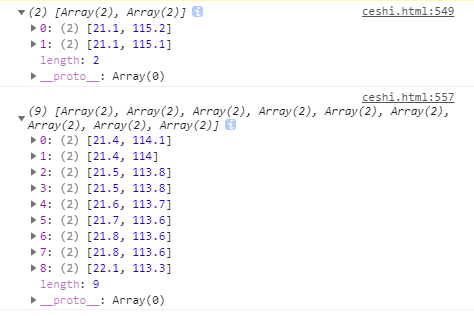

这样的话就遇到了一个问题 !这两条线你咋让他们连起来呢 ? 我的思路是,二级台风的线肯定要连上三级台风,所以在画线的坐标数据中添加了三级台风的第一个坐标 , 应该可以解决.咱们试试!

```
  newArr2 = [...newArr2, newArr3[0]]	//二级台风和三级坐标连接
  //给两段线路不同的颜色并添加到map地图上看看
  L.polyline(newArr2, { color: '#0000c0', weight: '2', }).addTo(map)	
  L.polyline(newArr3, { color: 'pink', weight: '2', }).addTo(map)		
```

有那么点意思了哈!

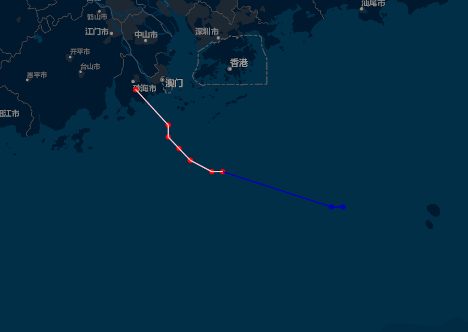


## 三 处理当前台风事件

### 台风信息tip

鼠标经过展示tip信息,这不就是咱们之前说的事件处理和提示框嘛 ! 

首先要有思路 , 给每一个点都绑定提示信息,那一定是在循环打点的时候绑定上的

```
//放在actualTrack.data.forEach循环打点里
	  dian2.on('mouseover', onmsm);		//dian2是打点时候var dian2的,给他绑定
      function onmsm(e) {		//因为是在循环里,所以可以拿到item并传递 之后的提示信息数据就在里面
        onmsover(e, item)		//触发onmsover函数,因为要写的东西比较多,咱把他写在循环外面
      }
```

```
function onmsover(e, item) {
      //popText是自己定义的html信息 使用`${}`的方式插入想要的数据
      var popText = `<div><h3 style="text-align: center;">台风等级:${item.typlevel}</h3></div>`
      //e.target是触发的点信息,没啥好说的,和入门的教程一样
      e.target.bindTooltip(popText, { direction: 'right', className: 'tips' }).openTooltip();
    }
```

铁汁们,是不是非常滴奈斯!

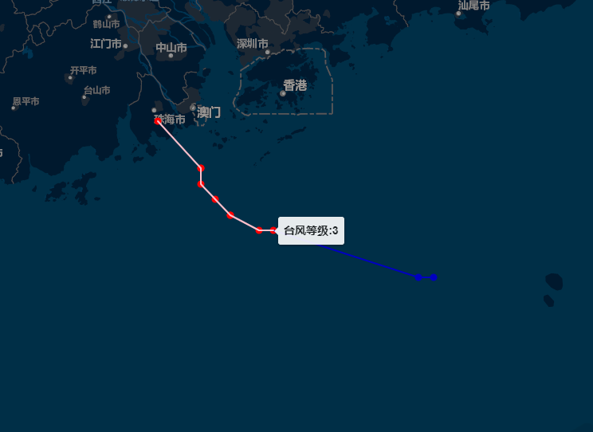

### 台风点击展示图标

和上面鼠标移入一个道理,给他绑个点击事件  .需要点击展示一个点标记,自定义图标,就行了!

```
 //触发ock函数,因为要写的东西比较多,咱把他写在循环外面
 	  dian2.on('click', onck);
      function onck(e) {
        ock(e, item)
      }
```

```
//图片路径记得改
function ock(e, item) {
      //定义标记点图标greenIcon
      var greenIcon = L.icon({
        iconUrl: './img/icon.gif', //图标路径
        iconSize: [26, 26], // 图标大小
        iconAnchor: [13, 13], // 偏移
      });
    }

// e.target._latlng就是当前点击标记点的坐标
//interactive表示不会遮挡事件,把图片置于底层       
tupian = L.marker(e.target._latlng, { icon: greenIcon, interactive: false }).addTo(map);
```

写到这就遇到一个问题了 ! 我怎么点谁都显示个图片啊?不行,咱得把其他的销毁 !! 我想到的方法比较笨,大概的思路就是定义一个变量控制是否销毁.

笨方法!见笑了!希望有大佬能提出改正

```
 //写在事件之外!最上面定义   充当全局控制器 
    window.flgpt = 0
```

```
	 //控制排他
      if (flgpt != 0) {
        map.removeLayer(tupian);	//移除map地图中的tupian图层
      }
      //这里写被控制的事件!!!!!  
      tupian = L.marker(e.target._latlng, { icon: greenIcon, interactive: false }).addTo(map); //没错,就是图片被控制了
      flgpt = 1 //控制器
```

这里再捋一下我的笨思路 1.定义一个全局控制器 2.通过全局控制器判断是不是第一次点击 , 如果不是第一次那就先移除图片 ! 3.改变控制器为已点击

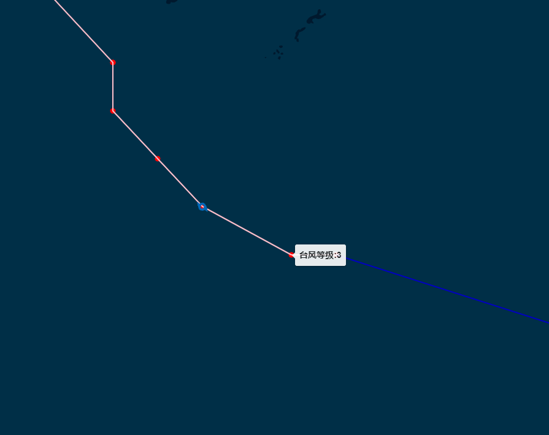


### 展示当前点台风预测路径

首先构思一下,点击的台风预测路径是动态响应的,也就是说点击点坐标的时候把点和相关数据循环并展示出来的...同上一节的道理,预测的路径也需要用我的笨蛋排他思想控制的,哈哈哈

- 先划线,把响应的数据过滤成二维数组

```
//写在被被控制的事件位置,看上一节有注释
	//遍历出二维数据用来画线预测线路坐标  forecastTrack是动态预测数据
      var newSj = forecastTrack.data.map(function (value, index) {
        return [value.lat, value.lon]
      })//newSj就拿到了过滤后的二维数组坐标
```

- 想要预测线路和当前台风点连接起来只需要把起点坐标插入到预测线路的二维数组里

```
yucexianlu = L.polyline([[e.target._latlng.lat, e.target._latlng.lng], ...newSj], { color: 'yellow', weight: '1', dashArray: '5' }).addTo(map);//我这里连写了 [[e.target._latlng.lat, e.target._latlng.lng], ...newSj] 就是插入了点坐标,应该可以看懂吧
```

- 预测线路有了,咱给他标上点吧!

```
forecastTrack.data.forEach((item) => {
//可以直接使用响应的数据循环 forecastTrack.data 
var dian3 = L.circleMarker([item.lat, item.lon], { color: '#FF0000', fillColor: '#FF0000', radius: 3, fillOpacity: 1 }).addTo(map);
})
```

- 别忘了,预测点也是有提示框的,给他也绑定提示框吧

```
		//绑定之前定义好的提示框就行了
		dian3.on('mouseover', onmsm);
        function onmsm(e) {
          onmsover(e, item)
        }
```

效果是不错的

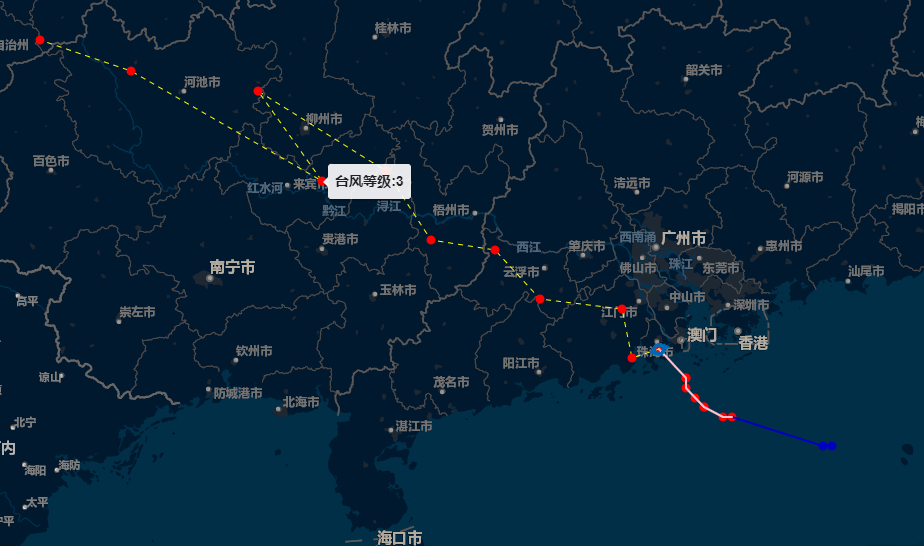

然后就遇到一个问题了,还是排他思想,这么多东西,我咋排他啊? 答案--把需要控制的这些东西放到一个图层组里,控制图层组 ! 是不是非常滴奈斯

```
//在最外面定义一个全局变量
window.tuceng3 = 0
//在forecastTrack.data循环标志点数据的外面定义一个图层
tuceng3 = L.layerGroup();  
```

- 创建的预测点和线就别addTo展示了,咱们放到组里统一管理 !

```
tuceng3.addLayer(dian3)  //这句放在点在循环里 被创建下   

tuceng3.addLayer(yucexianlu)//这句放在线被创建下   同时要在新建图层tuceng3这句下

tuceng3.addTo(map) //循环完事在下面展示图层组tuceng3到map地图上
```

- 排他控制器if中写入移除事件

```
map.removeLayer(tuceng3); ////移除map地图中的tuceng3图层组
```

一点小聪明而已,不知道这样用好不好 , 希望有大佬能提出更好的方法 !

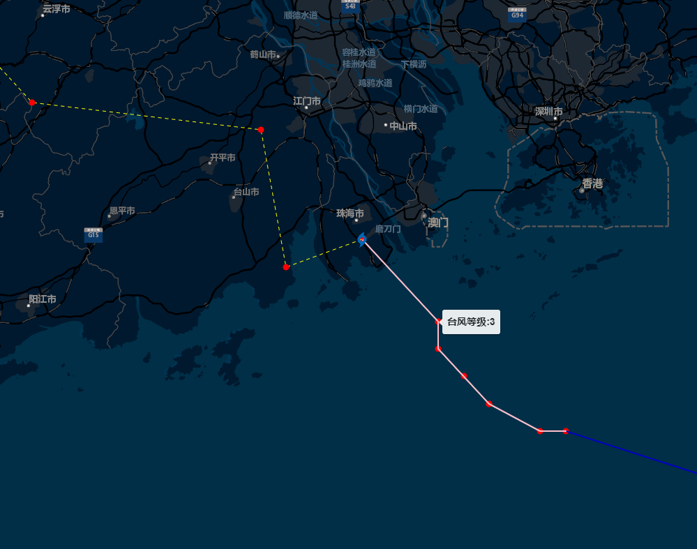


### 绘制台风半径圈

这里借助了一个三方插件Semicircle.js 原生的话很难画出不规则图形

- 点击出现的半径圈,当然是放在点击事件里的,先介绍一下这个插件怎么绘制扇形吧

```
	L.semiCircle(e.target._latlng, {
      radius: 500			//扇形半径
      startAngle: 0,		//绘制开始角度
      stopAngle: 90,		//绘制结束角度
      fill: true,			//填充
      fillColor: '#f03',	//填充色
      fillOpacity: 0.5,		//填充透明度
      color: 'transparent',	//边框颜色
      opacity: 0.5,			//边框透明度
      interactive: false,	//这个之前图片里面说过,把图形当成底层,不遮挡事件触发
    })
```

- 绘制一个台风半径圈是通过4个扇形组成的,如果是有两个扇形半径圈也是一样  这里太啰嗦了,直接复制粘贴就好

```
//注意!!台风圈是拼成的,也是需要统一管理的 , 所以放到图层组里
var tuceng4 = L.layerGroup(); //老规矩了,在外面新建图层组

//下面的内容放在点击事件被控制区域里   东西太多了看一条就好
//开头直接添加到图层组中
tuceng4.addLayer(L.semiCircle(e.target._latlng, {
      radius: item.level7radius1, //这是点击事件传下来的item信息中的第一块半径
      startAngle: 0,			//由于是四个扇形拼出来的,所以角度是0-90第一块,
      stopAngle: 90,
      fill: true,
      fillColor: '#f03',
      fillOpacity: 0.5,
      color: 'transparent',
      opacity: 0.5,
      interactive: false,
    }))
    
//复制4份就是一个台风组  这里是七级台风level7 还需要一个十级台风圈,再复制4份就好
//注意level7radius1是第一份扇形半径,复制四份是level7radius2...3..4这样.如果是十级就是这样level10radius1..2..3..4

tuceng4.addTo(map) //把扇形的图层组显示到map地图上
```

是不是很nice呢?

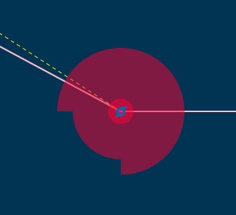

- 还是一样,进行排他控制


```
//在最外面定义一个全局变量
window.tuceng3 = 0
//在if排他控制器中写入移除事件
map.removeLayer(tuceng4);
//在if控制排他下面创建图层组
tuceng3 = L.layerGroup();  
```

完美!

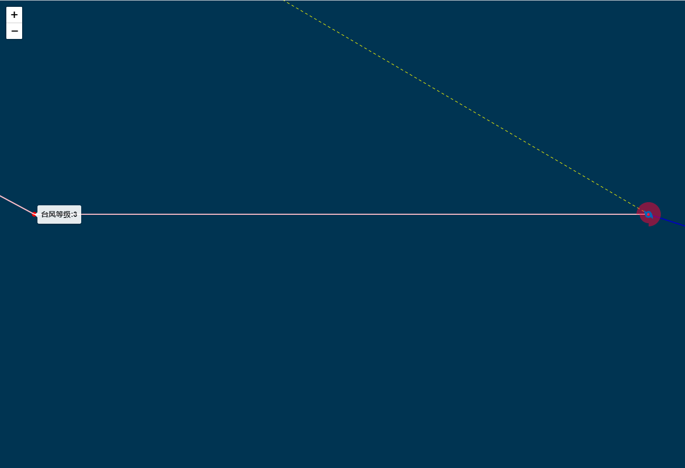


### 台风列表控制显示与隐藏

控制台风显示与隐藏,也就是控制台风路径的点与线的隐藏  添加到一个图层组统一控制就完事了

写出一个div作用是控制台风列表---我这里简单写一下就好,实现一下功能   记得z-index设置高一点

- 把点和线添加到同一个图层组

```
//在外面新建图层组tuceng2   在创建台风点线之前
window.tuceng2 = 0;
tuceng2 = L.layerGroup();
//在台风点(dian2)创建后添加到图层组tuceng2    因为是2段点,所以两个都加上   标记点的addTo(map)就删掉把!!!统一管理了
tuceng2.addLayer(dian2)
```

```
//之前分段添加台风线路的时候没命名,现在命名一下 var = xianlu1和2
var xianlu1 = L.polyline(newArr2, { color: '#0000c0', weight: '2', })  //后面的.addTo(map)就删了把!!!统一管理
var xianlu2 = L.polyline(newArr3, { color: 'pink', weight: '2', })
tuceng2.addLayer(xianlu1)		//添加到图层组tuceng2
tuceng2.addLayer(xianlu2)
```

创建一个变量控制图层的显示和隐藏

```
var flg = true	//列表显示和隐藏的控制器
    function shijian() {
      if (flg) {
        tuceng2.addTo(map);
        flg = !flg
      } else {
        flg = !flg
        tuceng2.remove(map)
      }
    }
```

确实隐藏了 , 但是预测路径等信息还在 ! 咋整捏?

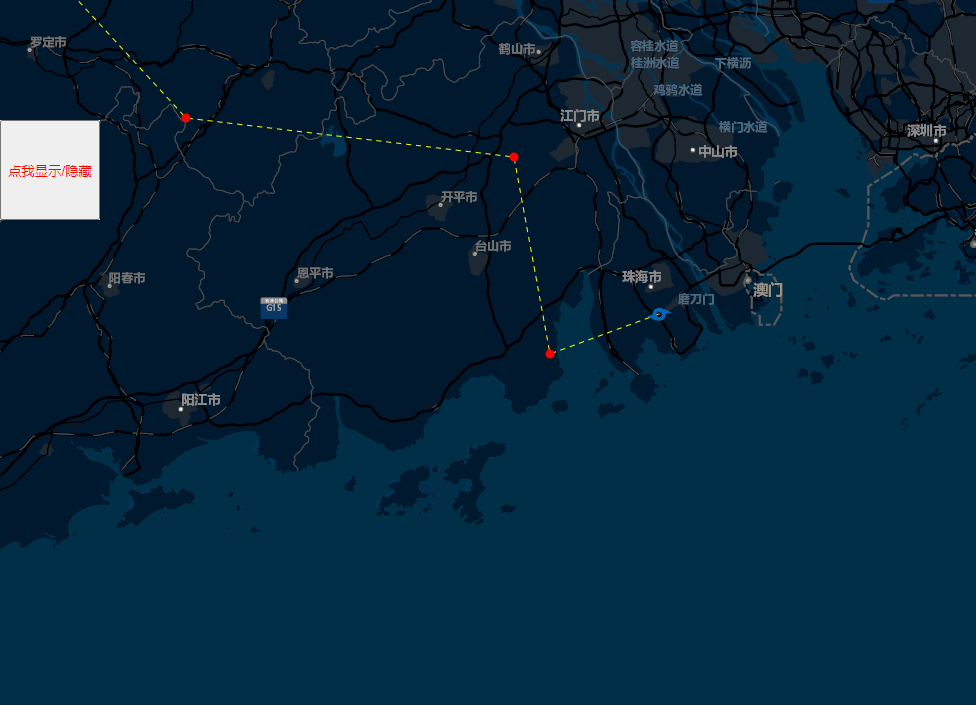

把点击事件里的控制器再触发一次就完事了 ! 这样写

```
	if (flg) {
        tuceng2.addTo(map);
        flg = !flg
      } else {
        if (flgpt != 0) {			//只是把点击事件里的排他控制器复制进来触发一次
        map.removeLayer(tuceng3);
        map.removeLayer(tuceng4);
        map.removeLayer(tupian);
      }
        flg = !flg
        tuceng2.remove(map)
      }
```

没毛病了 ! ! 老铁

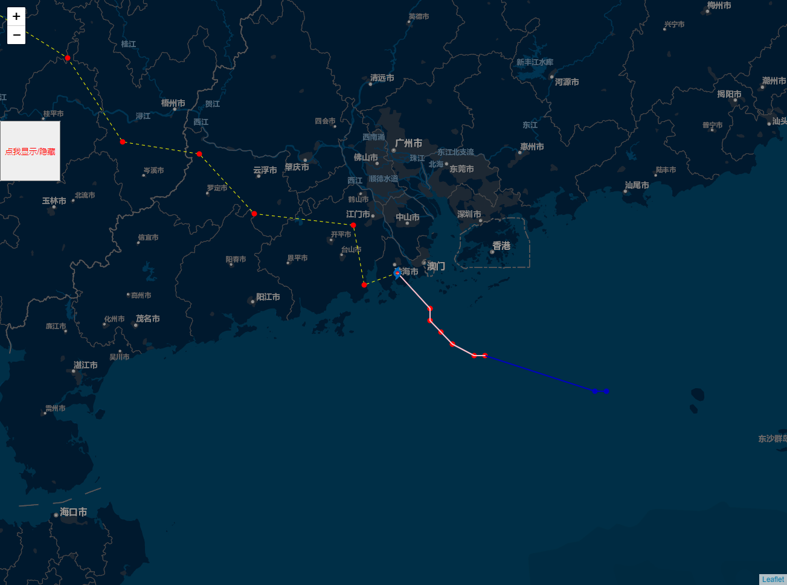


